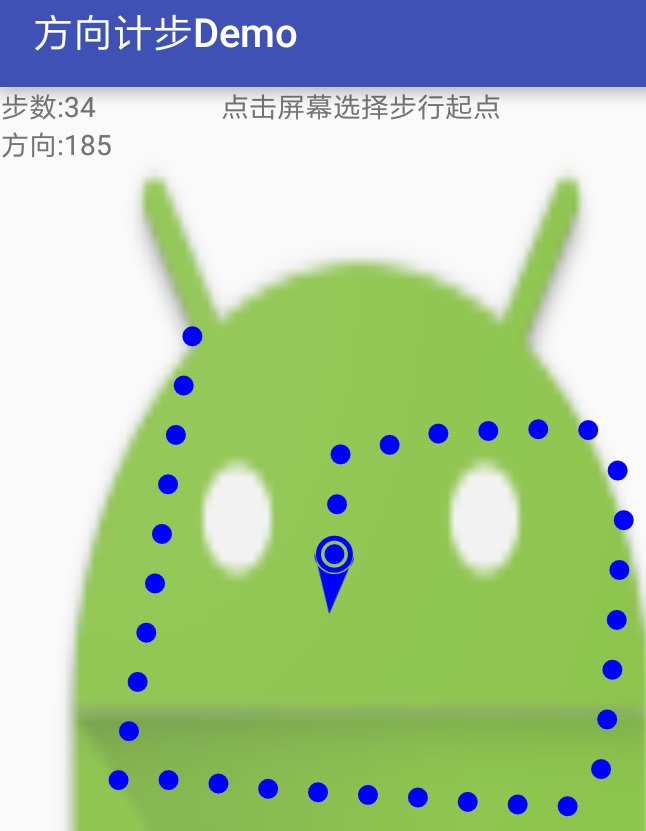

	注：我将很多AS项目配置都删了，导入项目后有可能gradle插件版本与Android studio不匹配，
	记得在build.gradle修改gradle插件版本，与Android studio版本匹配
	dependencies {
		classpath 'com.android.tools.build:gradle:2.3.1'
	}	 
	一般情况，Android studio版本与gradle插件版本一致，
	例如Android studio版本2.3，gradle插件版本2.3.0(必须是3位)
	    Android studio版本2.3.1，gradle插件版本2.3.1
	    Android studio版本2.3.2，gradle插件版本2.3.2

# 利用Android计步和方向传感传感器组合使用,可以在地图上记录人行走的轨迹图


## step包(计步功能):
	StepSensorBase.java 计步传感器抽象类，计步公用方法和变量
	StepSensorAcceleration.java 加速度传感器实现计步功能
	StepSensorPedometer.java 直接使用内置计步传感器实现计步功能
	
## orient包(方向功能):
	OrientSensor.java 方向功能
	
## SensorUtil.java 传感器工具方法，主要是修正方向算法(即转动停止后的方向,才作为行走轨迹的方向)

## 使用实例

```java

public class MainActivity extends AppCompatActivity implements StepSensorBase.StepCallBack, OrientSensor.OrientCallBack {
    private TextView mStepText;
    private TextView mOrientText;
    private StepView mStepView;
    private StepSensorBase mStepSensor; // 计步传感器
    private OrientSensor mOrientSensor; // 方向传感器
    private int mStepLen = 50; // 步长

    @Override
    public void Step(int stepNum) {
        //  计步回调
        mStepText.setText("步数:" + stepNum);
        mStepView.autoAddPoint(mStepLen);
    }

    @Override
    public void Orient(int orient) {
        // 方向回调
        mOrientText.setText("方向:" + orient);
//        获取手机转动停止后的方向
//        orient = SensorUtil.getInstance().getRotateEndOrient(orient);
        mStepView.autoDrawArrow(orient);
    }

    @Override
    protected void onCreate(Bundle savedInstanceState) {
        super.onCreate(savedInstanceState);
        SensorUtil.getInstance().printAllSensor(this); // 打印所有可用传感器
        setContentView(R.layout.activity_main);
        mStepText = (TextView) findViewById(R.id.step_text);
        mOrientText = (TextView) findViewById(R.id.orient_text);
        mStepView = (StepView) findViewById(R.id.step_surfaceView);
        // 注册计步监听
//        mStepSensor = new StepSensorPedometer(this, this);
//        if (!mStepSensor.registerStep()) {
        mStepSensor = new StepSensorAcceleration(this, this);
        if (!mStepSensor.registerStep()) {
            Toast.makeText(this, "计步功能不可用！", Toast.LENGTH_SHORT).show();
        }
//        }
        // 注册方向监听
        mOrientSensor = new OrientSensor(this, this);
        if (!mOrientSensor.registerOrient()) {
            Toast.makeText(this, "方向功能不可用！", Toast.LENGTH_SHORT).show();
        }
    }

    @Override
    protected void onDestroy() {
        super.onDestroy();
        // 注销传感器监听
        mStepSensor.unregisterStep();
        mOrientSensor.unregisterOrient();
    }
}
	
```
